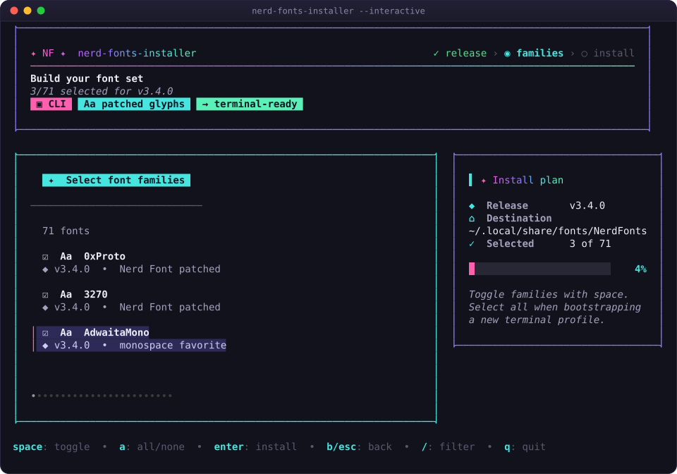
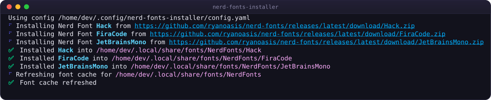
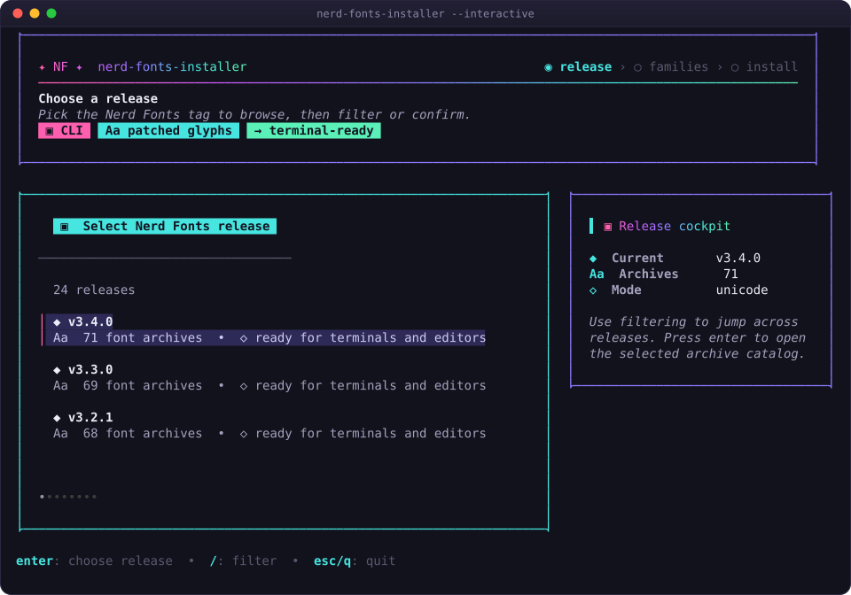
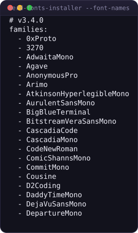
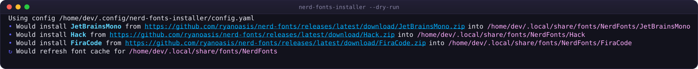

<div align="center">


# ✦ Nerd Fonts Installer

### 🎨 Nerd Fonts, installed the boring way.

**One config file. One command. Every machine.**

[](https://github.com/worxbend/nerd-fonts-installer/releases)
[](https://github.com/worxbend/nerd-fonts-installer/actions/workflows/ci.yml)
[](https://snapcraft.io/nerd-fonts-installer)
[](LICENSE)
[](https://go.dev)

[**🌐 Website**](https://worxbend.github.io/nerd-fonts-installer/) &nbsp;•&nbsp;
[**📖 Wiki**](https://github.com/worxbend/nerd-fonts-installer/wiki) &nbsp;•&nbsp;
[**📦 Releases**](https://github.com/worxbend/nerd-fonts-installer/releases) &nbsp;•&nbsp;
[**🐞 Issues**](https://github.com/worxbend/nerd-fonts-installer/issues)



</div>

---

## 🤔 Why?

Installing a Nerd Font by hand is eight steps of clicking, unzipping, and moving
files — and you do it again on every new laptop, container, and VM.

<table>
<tr><th align="left">😩 By hand, every time</th><th align="left">✨ With this</th></tr>
<tr valign="top"><td>

1. Open the Nerd Fonts release page
2. Find the right archive
3. Download it
4. Unzip it
5. Fish out only the font files
6. Move them to a font directory
7. Refresh the font cache
8. **Repeat for every font**

</td><td>

```bash
nerd-fonts-installer --dry-run
nerd-fonts-installer
```

…driven by four lines of YAML you keep
in your dotfiles.

**That's it.**

</td></tr>
</table>

Reach for it when you rebuild machines often, maintain dotfiles, bootstrap dev
environments, or just want the same glyphs in Starship, Neovim, tmux, lazygit,
eza, yazi, WezTerm, Alacritty, Kitty, Ghostty, and VS Code on every workstation.

---

## ⚡ Quick start

### 1️⃣ Install the binary

```bash
sudo snap install nerd-fonts-installer --classic
```

<details>
<summary>📥 <b>No snap? Grab a release tarball</b></summary>

<br>

| System | Asset |
| --- | --- |
| 🐧 Linux · Intel/AMD | `nerd-fonts-installer_latest_linux_amd64.tar.gz` |
| 🐧 Linux · ARM64 | `nerd-fonts-installer_latest_linux_arm64.tar.gz` |
| 🍎 macOS · Intel | `nerd-fonts-installer_latest_darwin_amd64.tar.gz` |
| 🍎 macOS · Apple Silicon | `nerd-fonts-installer_latest_darwin_arm64.tar.gz` |

The `latest` tag is a moving release with stable asset names, so these URLs
never change:

```bash
base=https://github.com/worxbend/nerd-fonts-installer/releases/download/latest
file=nerd-fonts-installer_latest_linux_amd64.tar.gz

curl -LO "$base/$file"
curl -LO "$base/checksums.txt"
sha256sum --check --ignore-missing checksums.txt

tar -xzf "$file"
cd "${file%.tar.gz}"

chmod +x nerd-fonts-installer
mkdir -p ~/.local/bin
mv nerd-fonts-installer ~/.local/bin/
```

If `~/.local/bin` is not on your `PATH`, add it to your shell config:

```bash
export PATH="$HOME/.local/bin:$PATH"
```

Check it works:

```bash
nerd-fonts-installer version
```

</details>

<details>
<summary>🔨 <b>Build from source</b></summary>

<br>

Requires Go 1.26 or newer. Nothing else.

```bash
git clone https://github.com/worxbend/nerd-fonts-installer
cd nerd-fonts-installer
go build -trimpath -o bin/nerd-fonts-installer ./cmd/nerd-fonts-installer

./bin/nerd-fonts-installer --version
./bin/nerd-fonts-installer --config config.example.yaml --dry-run
```

</details>

### 2️⃣ Write a config

```bash
mkdir -p ~/.config/nerd-fonts-installer
$EDITOR ~/.config/nerd-fonts-installer/config.yaml
```

```yaml
release: latest
destination: ~/.local/share/fonts/NerdFonts
refresh_font_cache: true
families:
  - JetBrainsMono
  - Hack
  - FiraCode
  - Meslo
```

### 3️⃣ Preview, then install

```bash
nerd-fonts-installer --dry-run   # 👀 shows every URL and destination
nerd-fonts-installer             # 🚀 actually installs
```



Then select the patched font — e.g. **JetBrainsMono Nerd Font** — in your
terminal or editor preferences and restart it. 🎉

---

## 🖱️ Don't want to write YAML yet?

```bash
nerd-fonts-installer --interactive
```

When no config file is found, `--interactive` opens a terminal picker: choose a
release, filter and tick families, press <kbd>enter</kbd>.



| Key | Action |
| --- | --- |
| <kbd>↑</kbd> <kbd>↓</kbd> | Move through releases or fonts |
| <kbd>/</kbd> | Search / filter |
| <kbd>enter</kbd> | Choose a release, or confirm the selection |
| <kbd>space</kbd> | Select or unselect a font |
| <kbd>a</kbd> | Select all / clear all |
| <kbd>b</kbd> <kbd>esc</kbd> | Go back |
| <kbd>q</kbd> <kbd>ctrl+c</kbd> | Quit |

> [!TIP]
> The picker's icons adapt to your terminal. Use `--icons ascii` over SSH into a
> box without patched fonts, or `--icons nerd` once you have them installed.

---

## ✨ What you get

| | |
| --- | --- |
| 📝 **Declarative** | YAML, JSON, or `.conf` — commit it with your dotfiles. |
| 🖱️ **Interactive** | A Bubble Tea picker when you'd rather point and click. |
| 🔒 **Checksum verified** | Every archive is checked against the release's `SHA-256.txt`. A mismatch aborts the install. |
| ⚡ **Concurrent** | Families download and extract in parallel, with clean non-interleaved output. |
| ♻️ **Atomic** | Staged in a temp dir, renamed into place, `.old` backup kept. A failed download never leaves half a font. |
| 👀 **Previewable** | `--dry-run` prints the plan; `list` and `--font-names` print paste-ready family names. |
| 📌 **Pinnable** | `release: v3.4.0` gives you the same bytes on every machine. |
| 🧹 **Tidy** | Installs only `.ttf`, `.otf`, and `.ttc`, one folder per family. |
| 🐧🍎 **Portable** | Single static binary. `fc-cache` is refreshed when present, skipped safely when not. |

---

## 📋 Copy-paste font names

Not sure what a family is called? Ask the tool:

```bash
nerd-fonts-installer list
```



It prints one family per line by default, so you can grep, pipe, or diff it
easily. Want the old YAML-ready block? `--font-names` is still available as a
backward-compatible alias, and `list --json` adds machine-readable output.

---

## ⚙️ Configuration

```yaml
release: latest
destination: ~/.local/share/fonts/NerdFonts
refresh_font_cache: true
families:
  - JetBrainsMono
  - Hack
```

| Key | Required | Default | Meaning |
| --- | :---: | --- | --- |
| `release` | — | `latest` | Release to install from: `latest` or a tag like `v3.4.0`. |
| `destination` | — | `~/.local/share/fonts/NerdFonts` | Root folder for installed families. |
| `refresh_font_cache` | — | `false` | Run `fc-cache -f <destination>` afterwards. |
| `families` | ✅ | — | Font archive names without `.zip`. |

<details>
<summary>📂 <b>Where config files are discovered</b></summary>

<br>

Highest priority first:

1. `--config <path>`
2. `$NERD_FONTS_INSTALLER_CONFIG`
3. `./nerd-fonts-installer.{yaml,yml,json,conf}`
4. `./nerd-fonts-installer/config.{yaml,yml,json,conf}`
5. The same app-named files under `$XDG_CONFIG_HOME`, when it is set to an
   absolute path
6. The same app-named files under `~/.config` otherwise

The recommended location is `~/.config/nerd-fonts-installer/config.yaml`.

`NERD_FONTS_INSTALLER_CONFIG` is honored by `--font-names` too, which makes it
handy in dotfiles, CI, and containers.

</details>

<details>
<summary>🍳 <b>Recipes: one font, a terminal set, pinned dotfiles, bootstrap scripts</b></summary>

<br>

**Just one font**

```yaml
release: latest
families:
  - JetBrainsMono
```

**A good terminal set**

```yaml
release: latest
destination: ~/.local/share/fonts/NerdFonts
refresh_font_cache: true
families:
  - JetBrainsMono
  - Hack
  - FiraCode
  - Meslo
  - SymbolsOnly
```

**Pinned, for reproducible dotfiles**

```yaml
release: v3.4.0
destination: ~/.local/share/fonts/NerdFonts
refresh_font_cache: true
families:
  - JetBrainsMono
  - Hack
```

**Into a scratch folder, to inspect before touching your real font directory**

```yaml
release: latest
destination: ./tmp/fonts
refresh_font_cache: false
families:
  - Hack
```

**In a bootstrap script**

```bash
#!/usr/bin/env bash
set -euo pipefail

mkdir -p ~/.config/nerd-fonts-installer

cat > ~/.config/nerd-fonts-installer/config.yaml <<'YAML'
release: latest
destination: ~/.local/share/fonts/NerdFonts
refresh_font_cache: true
families:
  - JetBrainsMono
  - Hack
  - FiraCode
YAML

nerd-fonts-installer --dry-run
nerd-fonts-installer
```

Exit codes are stable, so this is safe under `set -e`: `0` success or cancelled,
`2` for input you can correct, `1` for runtime failures.

</details>

---

## 🚩 Command reference

```text
nerd-fonts-installer [flags]
nerd-fonts-installer install [flags]
nerd-fonts-installer list [fonts] [flags]
nerd-fonts-installer info [flags]
nerd-fonts-installer version [flags]
nerd-fonts-installer completion [bash|zsh]
```

### Commands

| Command | What it does |
| --- | --- |
| `install` | Install fonts from config; also the default when you pass no subcommand. |
| `list` | List all family names for the resolved release, one per line or as JSON. |
| `info` | Print resolved config, release, destination, families, and build/runtime diagnostics. |
| `version` | Print version, commit, date, Go runtime, and platform information. |
| `completion` | Print a bash or zsh completion script. |

### Common flags

| Flag | What it does |
| --- | --- |
| `--config <path>` | Use a specific config file. |
| `--dry-run` | Print the plan without installing anything. |
| `--font-names` | Deprecated alias for `list`; keeps the old YAML-ready output. |
| `--interactive` | Open the terminal picker when no config is found. |
| `--icons <mode>` | TUI icons: `auto` (default), `nerd`, `unicode`, `ascii`. |
| `--json` | Print machine-readable JSON for `list`, `info`, and `version`. |
| `--release <tag>` | Inspect a specific release with `list` or `--font-names`. |
| `--verbose`, `-v` | Print extra diagnostics to stderr without changing stdout. |
| `--version` | Backward-compatible alias for `version`. |

```bash
nerd-fonts-installer --dry-run
nerd-fonts-installer list --release v3.4.0 --json
nerd-fonts-installer info
nerd-fonts-installer completion bash > ~/.local/share/bash-completion/completions/nerd-fonts-installer
```



---

## 📁 Install layout

```yaml
destination: ~/.local/share/fonts/NerdFonts
families:
  - JetBrainsMono
  - Hack
```

produces:

```text
~/.local/share/fonts/NerdFonts/
├── JetBrainsMono/
│   ├── JetBrainsMonoNerdFont-Regular.ttf
│   └── …
└── Hack/
    ├── HackNerdFont-Regular.ttf
    └── …
```

Each family gets its own directory. Existing files for a family are replaced
only after the new archive extracts successfully.

---

## 🩹 Troubleshooting

<details>
<summary><code>no config found</code></summary>

<br>

Either create a config…

```bash
mkdir -p ~/.config/nerd-fonts-installer
$EDITOR ~/.config/nerd-fonts-installer/config.yaml
```

…point at one explicitly…

```bash
nerd-fonts-installer --config /path/to/fonts.yaml
```

…or skip the file entirely and use the picker:

```bash
nerd-fonts-installer --interactive
```

</details>

<details>
<summary><code>duplicate font family "JetBrainsMono"</code></summary>

<br>

The same family is listed twice under `families:`. Remove the duplicate.

</details>

<details>
<summary><code>download … 404 Not Found</code></summary>

<br>

Almost always a wrong family name or release tag. Run
`nerd-fonts-installer list` (or the legacy `--font-names`) and copy the exact
name from the output.

</details>

<details>
<summary>The font installed, but I can't see it</summary>

<br>

Refresh the cache and restart the app you're selecting fonts in — terminals and
editors usually need a restart before new fonts appear:

```bash
fc-cache -f ~/.local/share/fonts/NerdFonts
```

</details>

<details>
<summary>Icons still look like boxes</summary>

<br>

Installing the font is only half the job — your app still has to *use* it.
Select the patched name in your terminal or editor preferences:

```text
JetBrainsMono Nerd Font
Hack Nerd Font
FiraCode Nerd Font
```

</details>

<details>
<summary>Notes for macOS</summary>

<br>

`fc-cache` usually isn't installed on macOS, so the cache refresh is skipped
safely. Many macOS users install into a local folder first and then import the
files with Font Book or another font manager.

</details>

---

## 🛠️ Development

```bash
make verify   # tidy + fmt + vet + lint + test + race + build + vuln + actionlint
make test     # go test ./...
make lint     # golangci-lint
make fmt      # gofmt -w
```

Agent and contributor guidance lives in [AGENTS.md](AGENTS.md); the architecture
map and invariants live in [MEMORY.md](MEMORY.md).

The terminal screenshots above are generated from real runs of the tool — see
[`scripts/screenshots/`](scripts/screenshots).

<details>
<summary>🏗️ <b>How it is put together</b></summary>

<br>

| Package | Owns |
| --- | --- |
| `cmd/nerd-fonts-installer` | Flags, command flow, exit codes. |
| `internal/config` | Config loading, defaults, validation, discovery. |
| `internal/fonts` | Downloads, checksum verification, extraction, atomic replacement, cache refresh. |
| `internal/nerdfonts` | GitHub release discovery. |
| `internal/fontname` | The single shared path-traversal validator. |
| `internal/tui` | The Bubble Tea interactive picker. |

The goal is not to be a full font manager. The goal is to make Nerd Font
installation boring, repeatable, and scriptable.

</details>

<details>
<summary>🚢 <b>Releases and snap publishing</b></summary>

<br>

The release workflow publishes versioned GitHub releases for `v*` tags and also
refreshes a moving `latest` release, so this download form is stable:

```text
https://github.com/worxbend/nerd-fonts-installer/releases/download/latest/<asset>
```

The snap workflow builds on pull requests, `main`, tags, and manual runs, and
publishes only on non-PR runs: `main` → `edge`, `v*` tags → `stable`, manual runs
→ the channel you choose.

Publishing requires the `nerd-fonts-installer` snap name to be registered and a
`SNAPCRAFT_STORE_CREDENTIALS` repository secret:

```bash
snapcraft export-login --snaps=nerd-fonts-installer \
  --acls package_access,package_push,package_update,package_release \
  /tmp/snapcraft-login.txt
```

Paste the file contents into the secret, then delete the local file. It is a
live credential — never write it inside the repository.

</details>

---

## 🙏 Credits

Fonts come from [ryanoasis/nerd-fonts](https://github.com/ryanoasis/nerd-fonts).
This project just installs them. The TUI is built with
[Bubble Tea](https://github.com/charmbracelet/bubbletea) and
[Lip Gloss](https://github.com/charmbracelet/lipgloss).

## 📄 License

[MIT](LICENSE).

<div align="center">
<br>

**If this saved you a few minutes on your next machine, a ⭐ is appreciated.**

</div>
